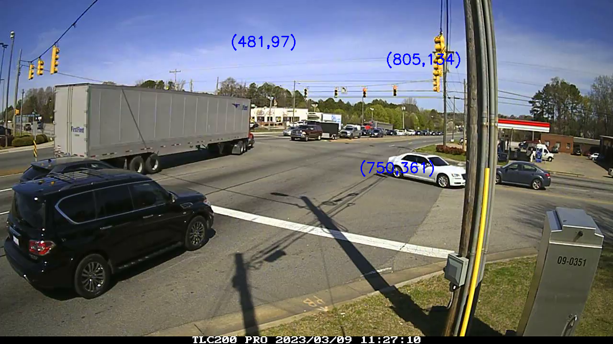
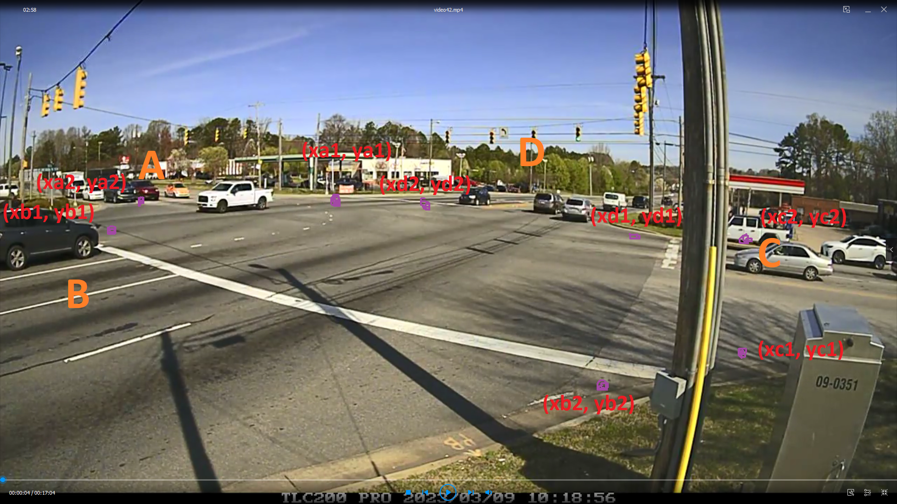

#Instruction
This project is to detect vehicles and count them and export data to excel file.

#Install

```
pip install -r requirements.txt
```

#Run

You can run in several ways

##To run with camara

###With CPU

```
sh run_camera_nocuda.sh
```

or

```
python main.py --camera cam --display
```

###With GPU

```
sh run_camera_cuda.sh
```

or

```
python main.py --camera cam --cpu use_cuda --display
```

##To run with video files

###With CPU

```
sh run_video_nocuda.sh
```

or

```
python main.py ./videos/[video name] --cpu use_cuda --display
```

###With GPU

```
sh run_video_cuda.sh
```

or

```
python main.py ./videos/[video name] --cpu use_cuda --display
```

You have to change [video name] with your video both in sh file and direct command
For example 'video1.mp4'

#How to setup environment variables

-Open .env file
-Change all the parameters

##Collect points from video

Run collictPoints.py file

```
python collictPoints.py [video path]
```

for example

```
python collictPoints.py ./videos/vidoe1.mp4
```

###If you click on mouse on the screen the point will be displayed.



###Bellow you can see the name of points in this poject

